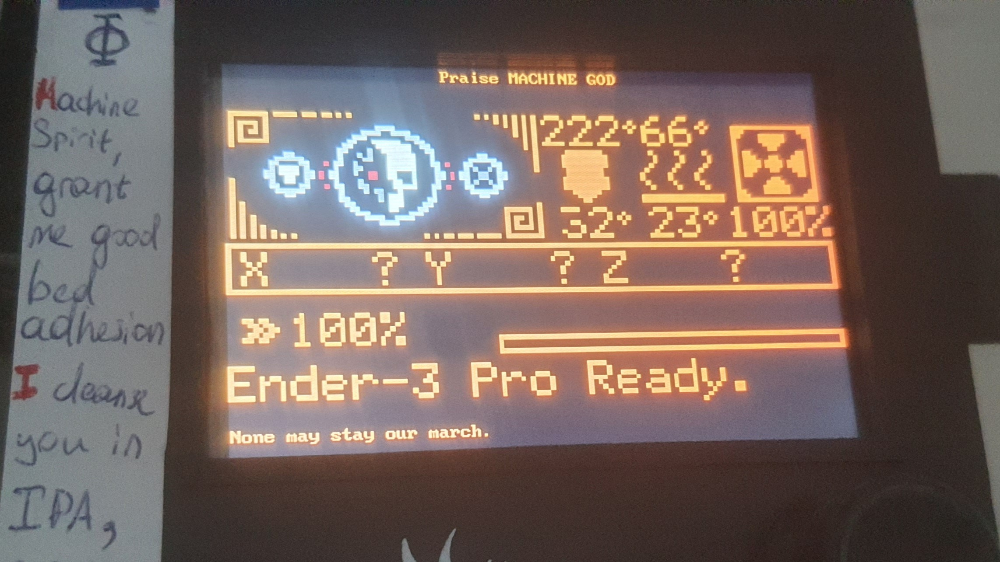

# NoTouchScreenFirmware

This is a fork of [zyonee/NoTouchScreenFirmware](https://github.com/zyonee/NoTouchScreenFirmware), which is a fork of [teeminus/NoTouchScreenFirmware](https://github.com/teeminus/NoTouchScreenFirmware), based on [bigtreetech/BIGTREETECH-TouchScreenFirmware](https://github.com/bigtreetech/BIGTREETECH-TouchScreenFirmware).

Most changes in this fork were done by Codex and loosely reviewed by me, [ELynx](https://github.com/ELynx).

# NoTouchScreenFirmware (Original)
Stripped down version of BIGTREETECH-TouchScreenFirmware which only supports ST7920 emulation (Marlin Mode). This project only uses peripheral drivers supplied by the screen manufacturer and uses it's own library to parse the ST7920 commands.

# What it does and what not (Original)
This firmware only emulates a ST7920. There is no support for touch, fonts, icons, etc. ...
I only tested the firmware with the TFT35v3. Others might work - or not. If someone wants to add support for other screens as well, this is very welcome. Don't blame me if it does not work for your display, if it burns down your house or causes any other harm.

## Supported BTT screens
Some legacy precompiled binaries can be found in the [binaries](binaries) folder.
This fork does not keep regenerated firmware artifacts in history; build the required PlatformIO environment for current output.
I only tested BIGTREE_GD_TFT35_E3_V3_0. All other environments are unverified.

| Environment                   | Tested |
|-------------------------------|--------|
| `BIGTREE_TFT24_V1_1`          | NO     |
| `BIGTREE_TFT28_V3_0`          | NO     |
| `BIGTREE_TFT35_B1_V3_0`       | NO     |
| `BIGTREE_TFT35_E3_V3_0`       | NO     |
| `BIGTREE_TFT35_V3_0`          | NO     |
| `BIGTREE_TFT43_V3_0`          | NO     |
| `BIGTREE_TFT50_V3_0`          | NO     |
| `BIGTREE_TFT70_V3_0`          | NO     |
| `BIGTREE_GD_TFT24_V1_1`       | NO     |
| `BIGTREE_GD_TFT35_B1_V3_0`    | NO     |
| `BIGTREE_GD_TFT35_E3_V3_0`    | YES    |
| `BIGTREE_GD_TFT35_V3_0`       | NO     |
| `BIGTREE_GD_TFT43_V3_0`       | NO     |
| `BIGTREE_GD_TFT50_V3_0`       | NO     |
| `BIGTREE_GD_TFT70_V3_0`       | NO     |
| `MKS_28_V1_0`                 | NO     |
| `MKS_32_V1_4`                 | NO     |
| `MKS_32_V1_4_NOBL`            | NO     |

## Installation and configuration
Check out the wiki for installation instructions and example configurations.

# Extra features

## SD text overlay
Enable `LCD_SD_TEXT_FILE` in [features.h](src/User/features.h) and put the named text file in the SD card root. The first line is used as the title bar; the remaining lines are shown below the emulated ST7920 area and loop every `LCD_SD_TEXT_DELAY_SEC`. This requires `SD_SPI_SUPPORT` and replaces `LCD_TITLE` or `SPI_DATA_RECEIVED_INDICATOR`.

## SD logo overlay (requires Marlin changes)
Enable `LCD_SD_LOGO_FOLDER` in [features.h](src/User/features.h), then put raw frame files `0.frb`, `1.frb`, and so on under that SD card folder. Convert numbered `0.png`, `1.png`, ... or `0.bmp`, `1.bmp`, ... files with `png_to_frb.py`. This requires `SD_SPI_SUPPORT`.

[png_to_frb.py](png_to_frb.py) writes row-major little-endian RGB565: two bytes per pixel. Use the same width and height as the Marlin status-logo marker rectangle.

You need to add two of diagonal opposite corner markers into custom status screen image to find corners. Size of custom status screen image should match with size of overlay frames.

| Corner | Marker bytes |
|--------|--------------|
| Top-left | `0xFF, 0x81, 0xBD, 0xA5, 0xB5, 0x85, 0xFD, 0x01` |
| Top-right | `0xFF, 0x81, 0xBD, 0xA5, 0xAD, 0xA1, 0xBF, 0x80` |
| Bottom-left | `0x01, 0xFD, 0x85, 0xB5, 0xA5, 0xBD, 0x81, 0xFF` |
| Bottom-right | `0x80, 0xBF, 0xA1, 0xAD, 0xA5, 0xBD, 0x81, 0xFF` |

References: [Marlin boot/status screen docs](https://marlinfw.org/docs/configuration/boot_status_screen.html) and [Marlin bitmap converter](https://marlinfw.org/tools/u8glib/converter.html).

# Further development (Original)
This project is ment not to be BTT exclusive. To achieve this goal we need to move away from the BTT sources and on to a more flexible framework. If you want your screen to be supported, feel free to create a MR.

# Support
Please support original authors, my personal contribution here is minimal.

# Support (Original)
If you like this project and/or want to support further development you might consider to  or 
